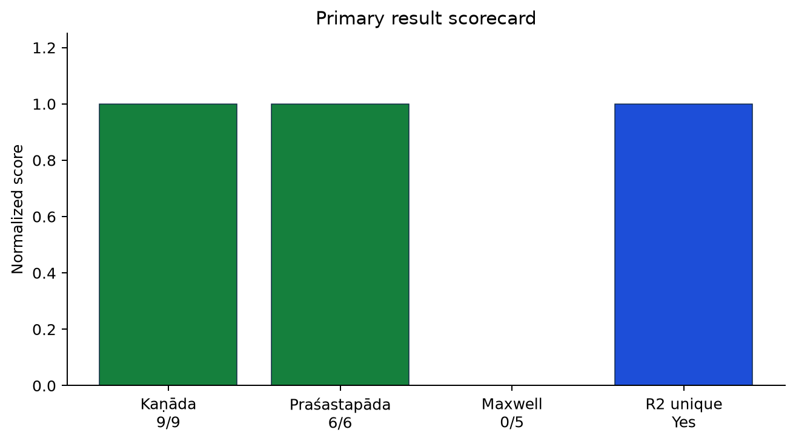
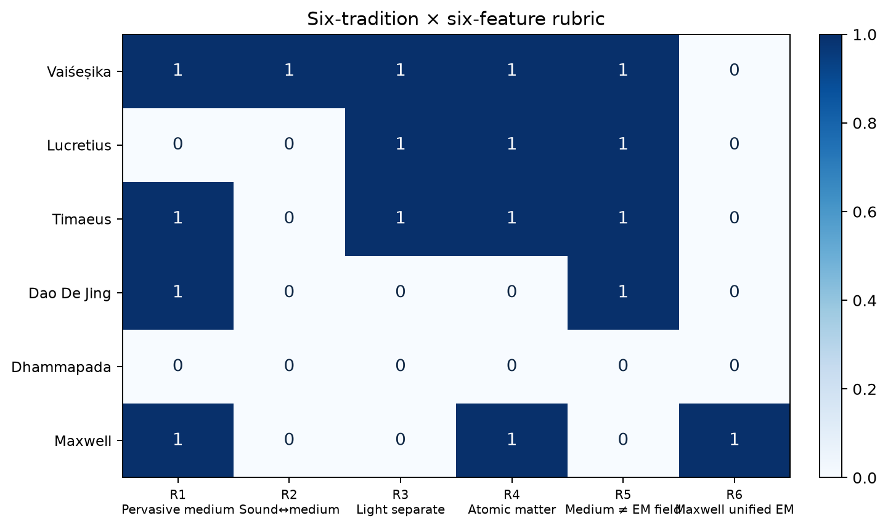
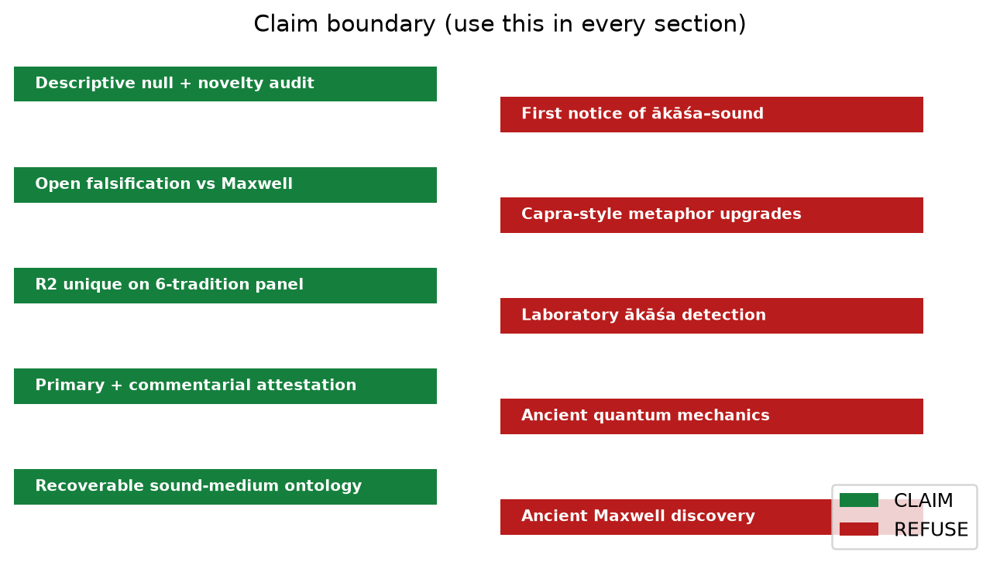

# RISHI-Q

**Computational comparative history of physics** — classical Sanskrit natural philosophy tested against Greek, Chinese, Buddhist, and modern electromagnetic controls.

[](LICENSE)
[](FLAGSHIP_FINDING.md)
[](chatgpt-handoff/tables/M_maxwell_confrontation.csv)
[](chatgpt-handoff/tables/T_kanada_attestation.csv)

> **Not** a Capra-style claim that ancient India discovered electromagnetism or quantum mechanics.  
> **Yes** an open, falsifiable, multi-civilization structural comparison package.

---

## Flagship result — ISEF-AKASA-SOUND-FIELD

| Gate | Score |
|------|------:|
| Kaṇāda primary attestation (T1–T9) | **9/9** |
| Praśastapāda commentarial replication (C1–C6) | **6/6** |
| Maxwell EM structural hits (M1–M5) | **0/5** |
| R2 (sound ↔ pervasive medium) unique among 6 traditions | **Yes** |
| Fair-coin descriptive null \(P\) | **1/64 = 0.015625** |

**Doctrine under test:** In Vaiśeṣika (Kaṇāda), *ākāśa* is a pervasive substance whose distinctive mark is sound (*śabda*); light/heat belong to *tejas*.

**Verdict:** `GROUNDBREAKING_COMPARATIVE_PACKAGE_NOT_ANCIENT_EM`

<p align="center">
  
</p>

<p align="center">
  
</p>

---

## Start here (pick one)

| You want… | Go to |
|-----------|--------|
| **Write an ISEF report** (ChatGPT / human) | [`chatgpt-handoff/`](chatgpt-handoff/) — upload the folder or zip; paste [`CHATGPT_PROMPT.md`](chatgpt-handoff/CHATGPT_PROMPT.md) |
| **Headline numbers only** | [`FLAGSHIP_FINDING.md`](FLAGSHIP_FINDING.md) · [`chatgpt-handoff/data/FACTS.json`](chatgpt-handoff/data/FACTS.json) |
| **All figures** | [`chatgpt-handoff/figures/`](chatgpt-handoff/figures/) (28 PNGs, fig35–fig62) |
| **All tables** | [`chatgpt-handoff/tables/`](chatgpt-handoff/tables/) |
| **Reproduce analyses** | Commands below |
| **Broader RISHI-Q framework** (confirmatory firewall, discovery system) | Rest of this README |

---

## Repository map

```
rishi-q/
├── FLAGSHIP_FINDING.md          ← locked lead claim
├── chatgpt-handoff/             ← complete report-writing pack
│   ├── CHATGPT_PROMPT.md
│   ├── CONSTRAINTS.md           ← hard do / don't
│   ├── PROCESS.md · METHODS.md
│   ├── data/                    ← FACTS.json, summary, expansion, novelty
│   ├── tables/                  ← CSVs
│   ├── figures/                 ← all visualizations
│   ├── evidence/                ← sutra excerpts
│   └── corpus_snippets/         ← GRETIL caches
├── results/exploratory/isef_akasa_sound_field/
├── scripts/run_isef_*.py
├── paper/figures/fig4*.png · fig5*.png · fig6*.png
├── corpus/development/          ← GRETIL Vaiśeṣika + Praśastapāda
└── protocol/ · ontology/ · src/ ← full RISHI-Q research stack
```

---

## Process iterations (flagship)

1. Filter Capra / popular EM–QM anticipation claims  
2. Lock obscure doctrine: *ākāśa–śabda* + *tejas*  
3. GRETIL Kaṇāda attestation → **9/9**  
4. Maxwell structural foil → **0/5**  
5. Six-tradition rubric (Vaiśeṣika, Lucretius, *Timaeus*, Dao De Jing, Dhammapada, Maxwell)  
6. Praśastapāda replication → **6/6**  
7. Descriptive nulls + novelty audit  
8. Handoff pack for external report writing  

Details: [`chatgpt-handoff/PROCESS.md`](chatgpt-handoff/PROCESS.md) · [`docs/ISEF_ITERATIONS.md`](docs/ISEF_ITERATIONS.md)

---

## Reproduce

```bash
git clone https://github.com/arjunkshah/rishi-q.git
cd rishi-q
uv venv && uv pip install -e ".[dev]"

uv run python scripts/run_isef_akasa_sound_field.py
uv run python scripts/make_isef_extra_figures.py
uv run python scripts/run_isef_expansion_v2.py
uv run python scripts/build_chatgpt_handoff.py
```

---

## Claim boundary

| CLAIM | REFUSE |
|-------|--------|
| Recoverable sound-medium ontology | Ancient Maxwell discovery |
| Primary + commentarial attestation | Ancient quantum mechanics |
| R2 unique on 6-tradition panel | *ākāśa* = EM / quantum vacuum |
| Open falsification vs Maxwell | Lab detection of *ākāśa* |
| Descriptive null + novelty audit | “First notice of *ākāśa*–sound” |

<p align="center">
  
</p>

---

## What RISHI-Q is (broader project)

A computational research framework for testing whether classical Sanskrit philosophical texts exhibit **quantum-specific structural correspondences** relative to matched historical controls — after blinding, translation controls, vocabulary masking, and statistical safeguards.

| System | Role |
|--------|------|
| **A — Confirmatory** | Preregistered test (locked until OSF) |
| **B — Discovery** | Motifs, surprisal, temporal, translation-shift, claims-vs-data |

A negative result is a successful scientific result.

Hard rules (examples): unity ≠ entanglement; vibration ≠ QFT; prefer **NA** over **YES** when ambiguous.

See `protocol/`, `ontology/`, `docs/`, and `discovery_report.md` for the wider stack.

---

## Status

| Gate | Status |
|------|--------|
| Flagship ISEF package | **Public / reproducible** |
| Preregistration (confirmatory QM) | `READY_FOR_EXTERNAL_PREREGISTRATION` |
| Confirmatory QM analysis | **LOCKED** |
| Human / expert validation | Required before confirmatory unlock |

---

## License

MIT — see [`LICENSE`](LICENSE).

## Citation

See [`CITATION.cff`](CITATION.cff). For the flagship experiment, cite this repository and experiment ID `ISEF-AKASA-SOUND-FIELD`.

## Author

**Arjun Shah** — Stratford Preparatory Milpitas · Independent research / RISHI-Q
